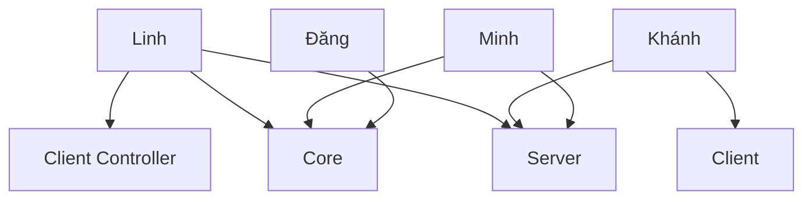

# BÀI TẬP LỚN - PHÁT TRIỂN HỆ THỐNG ĐẤU GIÁ TRỰC TUYẾN
Bài tập lớn nhóm 12 - LHP 2526II_UET.CS2043_2

## Chạy client với hot reload (dev)

Từ thư mục gốc dự án:

```bash
mvn -Pdev -pl client javafx:run
```

Hot reload theo dõi:
- `client/src/main/resources/css/app.css` và các file `@import` bên trong
- `client/src/main/resources/fxml/**/*.fxml` (reload khi file của scene hiện tại thay đổi)

Lưu ý:
- Chỉ bật trong profile `dev`.
- Chế độ mặc định (không `-Pdev`) không bật hot reload.


# TheAllNewBinance

> Bài tập lớn nhóm 12 - LHP 2526II_UET.CS2043_2  
> Dự án hệ thống đấu giá trực tuyến theo kiến trúc Maven multi-module.

## Tổng quan

TheAllNewBinance được tách thành 3 module:

- core: Domain model, DTO và các tiện ích dùng chung (Shared).
- server: Triển khai Service, Interface & Implementation DAO và tầng xử lý phía máy chủ.
- client: Module client (hiện đang ở giai đoạn khởi tạo cấu trúc).

## Sơ đồ phân công công việc



## Công nghệ sử dụng

| Thành phần | Công nghệ |
|---|---|
| Ngôn ngữ | Java 21 |
| Build tool | Maven (multi-module) |
| CSDL | MySQL (mysql-connector-j 8.4.0) |
| JSON | Gson 2.10.1 |
| Bảo mật mật khẩu | jBCrypt 0.4 |
| Test | JUnit 5 |
| CI | GitHub Actions |

## Cấu trúc dự án đến hiện tại
```
TheAllNewBinance/
├── .github/workflows/         # Cấu hình CI/CD (GitHub Actions)
│   └── main.yml               # Tự động chạy Unit Test khi push code
├── core/                      # Module chứa các lớp dùng chung cho Client và Server
│   └── src/main/java/com/auction/core/
│   │   ├── users/             # Entity: User, Item, Auction, Bid
│   │   ├── products/          # Quản lý sản phẩm đấu giá
│   │   ├── auction/           # Xử lý quá trình đấu giá
│   │   ├── service/           # Interface Service dùng chung (nếu có)
│   │   ├── dto/               # Data Transfer Objects (Dữ liệu gửi qua JSON)
│   │   └── utils/             # Các lớp tiện ích (JSON Mapper, DateFormatter, PasswordHasher, ...)
│   └── src/test/java/
├── server/                    # Module xử lý phía máy chủ
│   ├── src/main/java/com/auction/server/
│   │   ├── controller/        # Tiếp nhận và điều hướng request
│   │   ├── service/           # Logic nghiệp vụ (Auto-bid, Anti-sniping)
│   │   ├── dao/               # Data Access Object (Interface & Implementation)
│   │   ├── network/           # Xử lý Socket/REST API
│   │   └── ServerApp.java     # Lớp chạy Server chính (Singleton)
│   └── src/main/resources/
│   │   └── schema.sql         # Khởi tạo database
│   └── src/test/java/
├── client/                    # Module giao diện người dùng (JavaFX)
│   ├── src/main/java/com/auction/client/
│   │   ├── controller/        # Điều khiển logic giao diện (FXML Controllers) 
│   │   ├── network/           # Socket Client nhận realtime update
│   │   └── ClientApp.java     # Lớp chạy JavaFX chính
│   └── src/main/resources/    # Chứa file .fxml và CSS 
└── tests/                     # Các bài kiểm tra đơn vị (Unit Test)
    └── java/com/auction/logic/ # Test logic đấu giá, tranh chấp (Concurrency)
```
